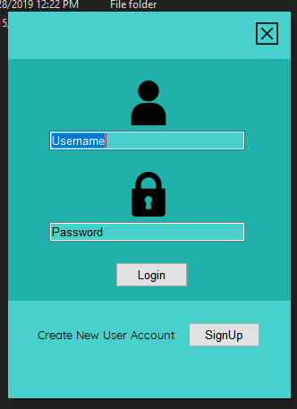

# Toll-Tax-Management-Desktop-App
## How to run the program?
Install Microsoft visual Studio 10 IDE. and run TollTaxApp .sln file. 
## About the Project:
A C# Toll Tax Management Desktop App. Coded on Microsoft Visual Studio 10 IDE. All the data storing, updation, deletion and selection is done on file  system(.txt). Updated version of this project with SQL database is on my Github Page.  
# Screens of the Application
## Login Form

